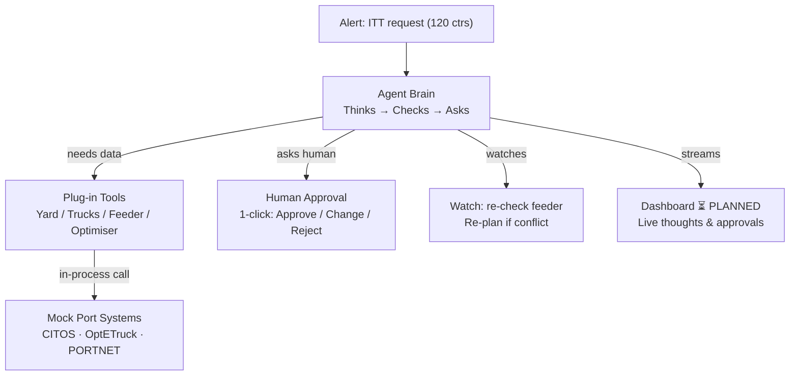

# PSA Nexus — Presentation Context V2 (Rubric-Aligned, Investor-Ready)

> **Purpose:** Single source of truth for an AI that will generate the **10-slide deck (appendix free)** for **PSA Code Sprint: Agentic AI in Action**.
> Judges are investors/operators, not AI researchers. Every slide must be understandable in 30 seconds.
>
> **Thesis to repeat on Slides 1, 4, 10:** **One brain, seven problems.** One agent core + 7 YAML configs. Flagship demo: **PB-12 — 120 containers PPT → Tuas** (road vs sea).
> **Status:** Phases 1–6 ✅ Built. **Phases 7 (Web UI) + 07.1 + 8 (Docker) ⏳ PLANNED** — any UI = wireframe with amber `⏳ PLANNED — Phase 7` ribbon; any deploy = `Local Docker localhost:8000 (Phase 8 planned)`. Never claim a live dashboard or public URL.
> **Tech (investor language first, details in appendix):** Single agent (not a swarm), plug-in tools, works with any AI provider. Technical name: Python + LangGraph + FastAPI.
> **Sources:** `buildplan/03-03-master-charter.md` (§1-9), `README.md:§2-5`, `CodeSprint.md`, `.planning/ROADMAP.md`

---

## How To Use This File (for the slide AI)

1. Build exactly **10 slides** in the order of §2. Copy titles verbatim.
2. **Bullet rule:** 3-4 bullets per slide, ≤12 words per bullet, no paragraphs. If you need more words, you are writing a paragraph — cut it.
3. **Jargon rule:** No `ReAct`, `StateGraph`, `MemorySaver`, `interrupt`, `ToolResult`, file paths on main slides. Say `thinks → checks → asks → acts → watches`. Put jargon only in appendix or speaker notes.
4. **Swarm rule:** This is a **single agent**, not a multi-agent swarm. Never say "agents" plural or "swarm".
5. **Visual rule:** One explanatory visual per slide (map/table/flow/chart). No decorative filler.
6. **Number rule:** Use only grounded numbers from §7. Do not invent.

---

## The 10-Slide Blueprint (maps every guideline bullet)

| Slide | Title | Guideline it satisfies | Visual (relevant, not filler) | Core message in one sentence |
|---|---|---|---|---|
| **1** | Title — One Brain, Seven Problems | — | Hub: 1 core → 7 problem cards (PB-12 big) | We built a coordination brain that solves 7 PSA problems, demoed on ITT. |
| **2** | The Problem & Why PSA Cares | Problem + PSA relevance | **Map: PPT → West Coast Hwy → AYE → Tuas (35km) + feeder sea route** with road/sea cost labels | 120 containers have no shared brain — phone calls guess the split, vessels wait. |
| **3** | Why This Needs an Agent | Why agentic > rule engine | 2-col table: Rule Engine vs Agent (4 rows, icons) | Static rules fail because data is late and plans change mid-job. |
| **4** | One Brain, Seven Problems — The Cluster Bet | **Cluster emphasis** + relevance | Hub-spoke: 1 core → 7 YAMLs + `POST /switch-problem/{id}` callout | Found 16 problems, 7 share one root cause — one platform pattern solves all. |
| **5** | How It Works — Agent Workflow | Key features + system workflow + execution flow | **6-step horizontal flow** (from `README.md:§4`) with Ask diamonds + Watch loop (red dashed T+21) | 6 plain steps: Alert → Look → Think → Ask → Act → Watch/Re-plan. |
| **6** | How Agentic AI Works Here | How agentic AI utilised + safety glimpse | Loop `Think → Act → Ask → Watch` + confidence gauge 0.85 | Single agent that checks, asks before spending, and re-plans when the port changes. |
| **7** | How We Built It | Technical architecture + implementation approach | **Simplified 4-box arch** (Alert → Brain → Tools → Mock Port Systems) + side `Dashboard WIP` | One app, plug-in tools, works with any AI — add a problem by adding a checklist. |
| **8** | What Data We Use & What We Assume | **Data sources / synthetic assumptions** (quarter slide) | Tiny 3-col table: Real System → Mock → Grounded Param | Mocks of CITOS/OptETruck/PORTNET with PSA-grounded $ params; synthetic but per-run isolated. |
| **9** | Money Saved — Why It Saves | **Potential impact** | **Waterfall/Sankey: $8,450 → $450 → $8K green delta** + transport inset | $8K/incident is vessel wait + extra trucks + feeder hold + re-handles avoided. |
| **10** | Safety, Scale & Next | Security/safety/scalability + key decisions + close | Roadmap timeline `Research→Tools→Agent ✅ → Dashboard WIP → Verify WIP → Docker WIP` + safety icons | Safe (asks before mutating), scalable (1 YAML = 1 problem), local Docker today — platform tomorrow. |

**Timebox (10 min):** 0:00-1:30 S1-2 problem, 1:30-3:00 S3-4 why agent + cluster, 3:00-5:30 S5-6 workflow + how agentic works, 5:30-7:00 S7-8 arch + data, 7:00-8:30 S9 money, 8:30-10:00 S10 safety/scale/close.

---

## Slide-by-Slide Spec (copy bullets verbatim, swap only team name)

### Slide 1 — Title
- **Bullets:**
  - PSA Nexus — One brain, seven problems
  - Cross-terminal ITT: 120 containers PPT → Tuas, no phone calls
  - 27 min vs 4–8 hours | $8K saved per incident
- **Visual:** Hub diagram, center = Agent Brain, 7 spokes = problem cards. Footer: Team [FILL], Deadline 2026-09-04.
- **Speaker note:** "One brain we built, seven port problems it solves. Today we demo ITT."

### Slide 2 — The Problem & Why PSA Cares
- **Bullets:**
  - Vessel at Tuas needs 120 containers from PPT — road or sea?
  - Today: 12+ phone calls, 60/40 guess, 30-60 min blind spot
  - PPT yard and Tuas yard systems don’t talk
  - Result: wrong split, vessel waits 2 hours, berth + QC domino
- **Visual:** Map PPT (Pasir Panjang) → road (West Coast Hwy/AYE, 35km, ~45/95 min) → Tuas + parallel feeder sea route. Callouts: `LTA: 1×40ft or 2×20ft per truck → 80 trips if all road`, `Road $150/trip | Sea $0 charter + $35/lift`.
- **Source:** `buildplan/03-03-master-charter.md:§1-2` — keep 16-problem table out of this slide (appendix A3).

### Slide 3 — Why This Needs an Agent (Not a Script)
- **Bullets:**
  - Data is late and patchy — not a clean lookup
  - Plan changes mid-job (feeder delayed after trucks left)
  - Needs 5 systems at once — no one owns the answer
  - Some calls are too pricey to auto-fire ($2.4K dispatch)
- **Visual:** Table `Rule Engine vs Agent` — rows: Stale data / Re-plan / Ask human / One config for 7 problems — with ✗/✓ icons.
- **Cut on slide:** `ReAct`, `deterministic`. Speaker note can say “the agent reasons and re-plans.”

### Slide 4 — One Brain, Seven Problems — The Cluster Bet
- **Bullets:**
  - Mined 16 port problems — 7 share one cause: phone-call coordination
  - Same 6 steps solve all 7 — only the checklist changes
  - New problem = new checklist (one config file), not a rebuild
  - Demo: ITT today → Berth Delay with one switch
- **Visual:** Hub-spoke: core `Agent Brain` → 7 YAML cards — PB-12 flagship large (`8 tools · $10,400`), PB-01/02/04/09/10/11 small. Annotation: `POST /switch-problem/{id}` — show PB-12 → PB-01 arrow.
- **Guideline hit:** This is the “cluster handles” proof — do not bury it.

### Slide 5 — How It Works — Agent Workflow (investor 6-step)
- **Bullets (plain language, from `README.md:§4`):**
  - 1. Alert — “120 containers ready at PPT”
  - 2. Look — trucks free? feeder on time? yard space?
  - 3. Think — best split: 80 road + 40 sea = $10,400
  - 4. Ask — human approves with 1 click (4 checkpoints)
  - 5. Act — send trucks, hold feeder, update Tuas loading
  - 6. Watch — feeder slipped? re-plan to 100/20, ask again
- **Visual:** Horizontal 6-step flow: circles for Look/Think/Act, yellow diamonds for Ask (×4), teal Watch box with red dashed loop `T+21m berth conflict → re-plan`. Happy path solid, deviation dashed. Label `80/40 → 100/20`.
- **Do not put on slide:** `T1 get_itt_candidates`, file paths.

### Slide 6 — How Agentic AI Works Here
- **Bullets:**
  - Single agent (not a swarm) — thinks, checks systems, asks, acts
  - Asks only before spending money or touching live ops
  - If data is stale or unsure, it stops and escalates
  - Every step logged: thought, tool, result, who approved
- **Visual:** Loop `Think → Act → Ask (if risky) → Watch → Re-plan` with gauge `Confidence 0.85 = ask human` and 8 tiny event dots (`thinking · tool_call · hitl_card · …`).
- **Cut:** `LLM self-assessment structured JSON`, `risk_score = ...` — appendix only.

### Slide 7 — How We Built It (architecture, no jargon)
- **Bullets:**
  - One app, one port — alerts, approvals, live updates
  - Brain + plug-in tools — new problem = new plug-in
  - Works with any AI — Claude, GPT, Gemini, or local — swap one line
  - Tested: 120-container run in ~40s (before human wait)
- **Visual:** Simplified 4-box arch: `Alert In → Agent Brain → Plug-in Tools → Mock Port Systems` with side box `Live Dashboard ⏳ PLANNED` subscribing to updates. No file paths on slide.
- **Speaker note (jargon lives here):** “Under the hood: FastAPI on :8000, LangGraph 4-node brain with human pause, YAML per problem.”
- **Detail for appendix mermaid (keep off slide but keep correct):**

### Slide 8 — What Data We Use & What We Assume (quarter slide — keep tiny)
- **Bullets:**
  - Mocks of real PSA systems: yard (CITOS), trucks (OptETruck), feeder (PORTNET)
  - Fixtures: 120 ctrs (40×40 + 80×20 = 160 TEU), 20 trucks, feeder 800/620
  - Costs grounded: $150/trip (LTA), $35/lift, $2,500/hr vessel — per charter §5
  - Limit: synthetic & per-run isolated, not live PSA integration
- **Visual:** 3-col table (4 rows) — `Real System | Mock | Grounded Param` — small font, no chart.
- **Keep this slide physically small — it’s a disclosure, not a story.**

### Slide 9 — Money Saved — Why It Saves
- **Bullets:**
  - Manual $8,450 → Agent $450 = **$8K saved / incident**
  - Transport: all-road $12K → mixed $10,400 saves $1,600 + 20 fewer AYE trips
  - Flagship: **$384K–$576K / yr** (4-6/mo) | 7-problem cluster: **$1.26M–$2.08M / yr**
- **Visual:** Waterfall bar: `$8,450` split into `Vessel 2h×$2.5K $5K | +5 trucks $750 | +Feeder 2h×$800 $1.6K | +20 re-handles $700 | +Staff $400` → `$450` bar → green `$8K` delta. Inset pill: `All-road 80 trips vs 60+40 split`.
- **Why it saves (1 line under chart):** vessel wait avoided ($5K) + fewer trucks ($750) + shorter feeder hold ($1.2K) + zero re-handles ($700) + less coordination ($350) minus $50 agent cost.

### Slide 10 — Safety, Scale & Next
- **Bullets:**
  - Safe: 4 approval asks + auto-escalates if unsure / stale / over $10K
  - Scale: 1 YAML = 1 problem — same brain, no rebuild
  - Built: alert → tools → approvals → watch. Next: dashboard + verification
- **Visual:** Left: roadmap timeline `Research ✅ → Tools ✅ → Agent ✅ → Dashboard WIP → Verify WIP → Docker WIP` (deadline 2026-09-04 gate). Right: 3 icons `✋ Ask before mutating | 🛡️ Guardrails + fallbacks | 🔀 Per-run isolated`.
- **Close line (large):** `27 min vs 4-8 hours. Same brain, seven PSA problems.`

---

## Data & Cost Ground Truth (for Slides 8-9, appendix)

**Grounded params (Singapore, `buildplan/03-03-master-charter.md:§5`):**
Vessel $2,500/hr, Feeder $800/hr, Road $150/trip (35km, LTA 1×40ft OR 2×20ft/truck), Sea charter `$0` (scheduled rotation) + handling $35/lift, Re-handle $35, Missed connection $150/ctr, Block max 4,500 TEU.

**Per-incident math (charter §5, `app/tools/optimiser.py:35`):**
`Manual $8,450 = Vessel 2h×$2.5K ($5K) + 5 trucks×$150 ($750) + Feeder 2h×$800 ($1.6K) + 20 re-handles×$35 ($700) + Staff 8h×$50 ($400)` → `Agent $450 = Feeder 0.5h×$800 ($400) + $50` → **Save $8K**.
Tool-level: All-road `80×$150=$12K` → Optimal `60×$150 ($9K) + 40×$35 ($1.4K)=$10,400` → save $1,600. Deviation `80/40 $10.4K → 100/20 $11.2K = 70×$150 + 20×$35` (+$800, avoids $5K miss).

**Impact:** Flagship 4-6/mo → $384K-576K/yr. Cluster C2 (7 problems, 18-30/mo) → **$1.26M-2.08M/yr**.

---

## What To Put In Appendix (excluded from 10, add freely)

- **A1** 16-problem bank + litmus 5-filter (full table) + C2 score 4.80
- **A2** Full 17-step swimlane (happy vs deviation, confidence 0.92→0.78→0.90) + 89.9s charter trace
- **A3** Technical arch Mermaid (detailed, with file:line) + Tech stack pinned versions
- **A4** HITL 5 gates (30/15/15/10/30 + per-gate timeout actions) + 7 triggers + 6 guardrails — full matrices
- **A5** Tool list PB-12 (8 tools) vs PB-01 (5 stubs) + one JSON schema example
- **A6** Data disclosure expanded + per-run isolation note (`_feeder_overrides[run_id]`)
- **A7** Resilience: 429→retry→fallback, 503/timeout split, hallucination handling, `FALLBACKS`
- **A8** Test evidence: `app/tests/test_agent_e2e.py` 5 green, `test_tools.py` 127 pass
- **A9** Research lineage: `research/`, `problems/`, `problem-selection/`, gap inventory 23 → 63 sub-phases

---

## Jargon → Investor Translation (for speaker notes only)

| Never on slide | Say on slide | Put in notes/appendix |
|---|---|---|
| ReAct / StateGraph / MemorySaver | thinks → checks → asks → acts | LangGraph StateGraph with `thread_id` |
| `interrupt` / `Command(resume=)` | pauses for 1-click approval | `app/hitl/gates.py: interrupt()` + `Command` |
| `ToolResult` / `ToolRegistry` | plug-in tools / checklist | `app/tools/registry.py: TOOLSETS` |
| `confidence 0.85` | if unsure, it asks | LLM confidence + 7 triggers |
| `in-process mock` | mock port systems (per-run isolated) | `app/mocks/data.py: _feeder_overrides` |
| `provider abstraction 8 providers` | works with any AI | `app/shared/provider.py`, `tool_adapter.py` |

---

## Sources (cite, don’t fabricate)

`buildplan/03-03-master-charter.md:§1-9` · `README.md:§2-5` · `CodeSprint.md` · `.planning/ROADMAP.md` (63 sub-phases, 8.3 local-only) · Runtime: `app/agent/graph.py:64`, `app/agent/nodes.py:15/472`, `app/agent/monitor.py`, `app/agent/state.py:10`, `app/hitl/models.py:54`, `app/configs/pb-12-itt.yaml`, `app/mocks/data.py`, `app/tools/optimiser.py:83`

---

*Output for next AI: 10 slides per table above + appendix A1-A9 + speaker notes. If this context and a slide conflict, fix the slide.*
