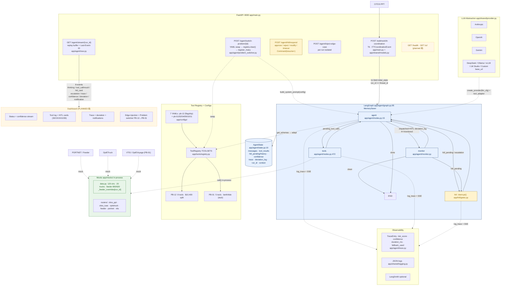

# PSA Nexus — Presentation Context V2 (Rubric-Aligned)

> **Purpose:** Source-of-truth for an AI that will generate the **10-slide deck (appendix excluded)** for **PSA Code Sprint: Agentic AI in Action**. This version is strictly aligned to the official deck guidelines and the required narrative: **solution architecture, execution flow, key decisions, potential impact, security/safety/scalability.**
>
> **Flagship:** `PB-12 — Multi-Party ITT Coordination Failure (PPT → Tuas, 120 containers)`  
> **Platform thesis (emphasise everywhere):** Cluster C2 — **7 problems, one brain.** Same LangGraph core, one YAML per problem, tool registry swap. Demo flagship PB-12; prove generalisability via PB-01 (Berth Delay).  
> **Status flag — READ BEFORE DRAWING:** Phases 1–6 ✅ COMPLETE. **Phases 7 (Web UI) + 07.1 (Integrated Verification) + 8 (Docker/Deploy) are PLANNED, NOT BUILT.** Render any UI as **wireframe with “⏳ PLANNED — Phase 7” ribbon**, not a screenshot. Render deploy as **“Local Docker localhost:8000 (Phase 8 planned)”**, not a public URL.  
> **Tech (locked):** Python 3.11, LangGraph 1.2.11, FastAPI, in-memory state, YAML configs, no DB, SSE replay buffer, LangSmith optional, 8 LLM providers, in-process tool calls  
> **Canonical sources:** `buildplan/03-03-master-charter.md` (charter §1–9, 23 gaps), `.planning/PROJECT.md`, `.planning/ROADMAP.md`, `README.md:§2–5`, `CodeSprint.md`

---

## 1) Deck Contract (what the slide-AI must deliver)

**10 slides max, appendix free.** Cover exactly these guideline bullets — every bullet must appear on at least one slide (see §10 for the mapping):

1. **Problem statement & PSA relevance**
2. **How Agentic AI is utilised** (not a chatbot, not a rule engine)
3. **Key features & system workflow**
4. **Technical architecture & implementation approach**
5. **Data sources used / assumptions (synthetic data)**
6. **Solution architecture, execution flow, key decisions, potential impact, security/safety/scalability** (the five required lenses — judge-scored)

**Rules:** one visual per slide, 3–5 bullets per slide, mono math for ROI, ≤12-line code snippet only where it proves a claim. Cite `file:line` or charter §. Do not invent numbers — use `buildplan/03-03-master-charter.md:§5` grounded params.

---

## 2) One-Liner (use on Slide 1, repeat on Slide 10)

**One brain, seven problems.** PSA Nexus is a provider-agnostic, agentic coordination platform for PSA Singapore. One LangGraph reasoning core + 7 YAML configs + 8 LLM providers. Flagship: **120 containers PPT → Tuas** (road vs sea split) where CITOS PPT and CITOS Tuas are not integrated and the split is today negotiated by phone. Saves **$8K/incident → $384K–$576K/yr flagship → $1.26M–$2.08M/yr cluster.**

```
PSA Nexus
├── One LangGraph core — same reasoning for every problem
├── 7 YAML configs — swap one file, get a different problem
├── 8 LLM providers — Claude / GPT-4o / Gemini / DeepSeek / Ollama / vLLM / LM Studio / any OpenAI-compatible base_url
└── Live control plane (PLANNED) — approve plans, inject edge cases, switch problems
```

---

## 3) Problem Statement & PSA Relevance (Slides 1–2)

### What breaks (PB-12 flagship)
A vessel at **Tuas Port** needs **120 containers** from **Pasir Panjang Terminal (PPT)** before departure. Road (OptETruck, ~35 km via West Coast Hwy→AYE→Tuas Blvd, 45 min off-peak / 95 min peak) and sea (feeder via PORTNET) compete. **PPT CITOS and Tuas CITOS are separate instances** — PORTNET sync lags 30–60 min, so readiness at PPT is invisible at Tuas in real time. No optimiser owns the road/sea split; PPT planner, Tuas planner, and feeder operator negotiate a 60/40 guess **by phone**.

**When it fails:** Feeder berth conflict delays sea leg *after* trucks are already dispatched → trucks cannot be re-routed, vessel loading stalls 2 hours. Charter §2 as-is: 12 steps, 4–8 hours, 12+ phone calls.

**Why this matters to PSA:** Transhipment hub throughput is vessel dwell + yard re-handles. A single missed split ripples to berth occupancy, QC schedule, and downstream feeder connections at Port Klang (tidal window). Charter impact: $15.6K–$29K gross exposure per incident, **$8K friction recoverable** by automation.

### The cluster (emphasise on every slide)
PB-12 is not alone. Cross-system phone coordination is the **root cause** of 7 of the 16 mined problems:

**Cluster C2 — Manual Multi-Party Coordination (score 4.80/5.00, highest agentic sweet-spot):**

| Problem | What breaks | Who calls whom (today) |
|---|---|---|
| **PB-01 Berth Delay Cascade** | Vessel ETA slip → stale berth plan + tidal miss | VTIS → OptEVoyage → CITOS |
| **PB-02 DTQC Breakdown** | QC fails → AGV queue → vessel cascade | ROCC → CITOS → FMS |
| **PB-04 Missed Feeder Connection** | Feeder departs without 100+ transhipment ctrs | PORTNET → CITOS |
| **PB-09 Expressway Blockage** | 40% trucks miss slots → yard/loading cascade | OptETruck → SmartBooking |
| **PB-10 Sea-Air Cut-Off** | Sea leg delay → air freight must rebook | OptEModal → TradeNet → SATS |
| **PB-11 Customs Hold** | Hold mid-transit → no partial release | TradeNet → CALISTA |
| **PB-12 ITT Coordination (flagship)** | Road/sea split guessed, feeder delayed | CITOS PPT → OptETruck → PORTNET/feeder → CITOS Tuas |

6 shared primitives make one platform sufficient: **Event Ingestion · Reasoning Planner · Multi-Tool Orchestrator · HITL Gate · Multi-Party Notification · Deviation Logger**. Charter §6 — if you build for PB-12, you reuse the same primitives for the other six.

> For the full 16-candidate bank and 5-filter litmus test, cite `problems/02-03-problem-bank.md` and `problem-selection/03-01-litmus-test-scores.md` — do **not** put the 16-row table on a main slide; reserve it for appendix.

---

## 4) How Agentic AI Is Utilised (Slides 3–4, judge-scored Agentic Design)

**Why not a rule engine or chatbot:**

| Property | Rule engine | PSA Nexus agent |
|---|---|---|
| Data | Assumes fresh & complete | Handles stale PORTNET (30-min lag), partial weights, missing ctrs |
| Plan | One fixed sequence | Dynamic — re-computes 80/40 → 100/20 when feeder slips |
| Failure | Crashes or silently continues | Guardrail → fallback → notify → escalate |
| Human role | All-manual or all-auto | Calibrated: autonomous gather, **HITL before any state mutation** |
| Reuse | New code per problem | Same core, new YAML |

**Agentic capabilities (6 required by CodeSprint brief — map each explicitly):**

1. **Event Ingestion & Perception** — `POST /webhook/itt-coordination` (`app/main.py`, `app/shared/models.py:ITTCoordinationEvent`) parses `vessel_id, container_count≥50, blocks, departure>now+2h`, bootstraps 11-field `initial_state` with `run_id`.
2. **Reasoning & Dynamic Planning** — `app/agent/nodes.py:15 agent_node` runs a ReAct loop: templated `build_system_prompt(config)` (`app/agent/prompts.py`) + 7 YAML-aware tools + `compute_itt_split` optimiser → no hardcoded ITT wording. Fast-path HITL avoids 30 s LLM wait while preserving charter sequence.
3. **Tool & System Orchestration** — `app/tools/registry.py:TOOLSETS` with `register_for_problem(id)`; PB-12 = 8 tools, PB-01 = 5 tools. In-process calls to `app/mocks/data.py` (G-06 decision) so orch is observable without HTTP hops. `app/shared/tool_adapter.py` normalises OpenAI / Anthropic `input_schema` / Gemini `functionDeclarations`.
4. **State Tracking & Observable Trace** — `AgentState` (`app/agent/state.py:10`) + `MemorySaver(thread_id=run_id)` (`app/agent/graph.py:95`) + `TraceEntry` (`app/agent/trace.py`: `risk_score, confidence, duration_ms, fallback_used`) → structured JSON logs (`app/shared/logging.py`) + optional LangSmith + SSE replay.
5. **Human-in-the-Loop Controls** — 5 gates HITL-1..5 (`app/hitl/models.py:54`) with `interrupt()` (`app/hitl/gates.py`) + `Command(resume=)` — see §7 safety.
6. **Uncertainty & Error Recovery** — confidence self-assessment (`app/agent/confidence.py`, threshold 0.85) + 6 guardrails (`app/agent/validation.py`) + 7 escalation triggers (`app/agent/escalation.py:149`) + rate-limit 429→retry→fallback + hallucination → error `ToolResult`.

---

## 5) Key Features & System Workflow (Slide 5)

**The 17-step flagship workflow — two paths, one graph:**

```
Happy path (10 steps):  T1 get_itt_candidates (120 ctrs, 160 TEU) 
                    → T2 check_road (20 trucks, 90 min) ∥ T3 check_sea (feeder 800/620, window 1400–1600, tidal Port Klang)
                    → T4 compute_itt_split → HITL-1 “Approve $10,400 split” (30m/escalate)
                    → T7 dispatch_road_itt via West Coast Hwy→AYE→Tuas (HITL-2, 15m/cancel)  ∥  T8 request_feeder_hold 1h (HITL-3, 15m/escalate)
                    → T5 update_tuas_loading_sequence (HITL-4, 10m/hold_sequence) → done  (deviation_log == [])

Deviation path (+7 steps):  monitor re-queries T3 at T+21m → berth_status=conflict → confidence 0.92→0.78
                         → re-compute 80/40 → 100/20 (70 trips ×$150 + 20×$35 = $11,200)
                         → HITL-5 emergency (30m/halt) → delta +4 trucks → second Tuas update → deviation_log populated
```

**What the user sees (planned UI — render as wireframe):** streaming reasoning, tool log per call, 5 HITL cards (Approve / Reject→alternatives / Modify→re-run T4 / Timeout→per-gate action), trace sidebar with deviation trail, **edge-injection buttons (“Inject AFTER dispatch, BEFORE monitor”)** — mutation is per-run (`_feeder_overrides[run_id]` in `app/mocks/data.py`), so next T3 sees the conflict without leaking to other runs. Problem switcher dropdown `PB-12 ↔ PB-01` proves the platform claim.

**Features slide must state explicitly:** **Cluster-ready by design** — adding PB-02/04/09/10/11 is a YAML + 3–5 tool stubs (`app/tools/pb01/` is the reference), not a new agent.

---

## 6) Solution Architecture (Slide 6 — the main diagram)

### Mermaid — copy verbatim to deck (renders on GitHub, VS Code, HackMD)



**Invariants to call out next to the diagram (1 line each):**
- `run_id == thread_id` for checkpoint continuity (`app/agent/run.py`).
- Single `hitl` node with `interrupt(approval_card)` is the **only** pause mechanism; resume is `Command(resume=decision)`.
- Tool calls are **in-process Python** (charter G-06) — deterministic, fast, per-run isolated; no extra HTTP hop.
- YAML swap is atomic: `load_problem_config(id) → registry.clear() → register_many()` + re-templated prompt.

---

## 7) Technical Implementation Approach (Slide 7)

| Decision area | Choice | Where | Why |
|---|---|---|---|
| Agent framework | **LangGraph 1.2.11 `StateGraph`** with `MemorySaver`, not a linear orchestrator | `app/agent/graph.py:64` | HITL pause/resume is first-class; conditional edges express monitor→re-plan without hardcoding recovery |
| HITL shape | **Single `hitl` node** (`interrupt`+`Command`) vs 5 nodes | `app/hitl/gates.py`, `app/hitl/models.py:54` | Avoids the “5-node + dynamic routing” bug; preserves checkpointed `hitl_pending` |
| Prompt | **Templated `build_system_prompt(config)`** | `app/agent/prompts.py` | Same core runs PB-12 and PB-01 — prompt is derived from YAML (sector, systems, tools, cost params), not hardcoded to ITT |
| Tools | **In-process registry** (`TOOLSETS`, `FALLBACKS`) | `app/tools/registry.py` | E2E tests run without a live server; fallback can be exercised deterministically |
| LLM | **8 providers, 4 families** via `tool_adapter` | `app/shared/provider.py`, `app/shared/tool_adapter.py` | Swap `provider: anthropic→custom + base_url` (OpenRouter/Together/Groq) without touching agent code |
| Resilience | **Deterministic mock fallback** | `app/agent/nodes.py:_mock_provider_for_state` | Graph completes E2E without a real API key (charter 17-step workflow preserved); real provider wired in same path with `chat_with_rate_limit` (429→retry→fallback) |
| State | **Truncate containers 120→5 in checkpoint/messages** | `app/agent/nodes.py:472` | Avoids `StateGraph` deepcopy blow-up; full data kept in `context` for optimiser/validation |
| Data | **In-memory + YAML, no DB** | `.planning/PROJECT.md` constraints | Demo scope — sufficient and zero-ops |
| Delivery | **Bulkheads per-run** | `app/mocks/data.py:_feeder_overrides[run_id]`, `app/agent/sse.py:buffers` | Concurrent runs + edge injections never leak |

**Build reality:** Phases 1–6 done (184 tests: `app/tests/test_tools.py`, `app/tests/test_agent_e2e.py` 5 green, confidence `0.95→0.78→0.90`, `deviation_log` populated). Phases 6.5/7/07.1/8 planned — mark as WIP.

---

## 8) Data Sources, Synthetic Data & Assumptions (Slide 8 — required by guidelines)

Be explicit — judges score “assumptions if using synthetic data”.

| Source (real PSA system) | What we mock | Fixture (synthetic) | Grounded assumption | Where |
|---|---|---|---|---|
| **CITOS PPT** (terminal OS) | Container readiness: `get_itt_candidates` | 120 ctrs = 40×40ft + 80×20ft = 160 TEU, blocks B-07/08/12/14, 3 DG, LTA 80 trips if 100% road | LTA chassis 1×40ft OR 2×20ft/truck; block max 4,500 TEU (CITOS param) | `app/mocks/data.py`, `app/mocks/routers/citos_ppt.py` |
| **OptETruck** (TMS) | Road capacity: `check_road_itt_capacity` | 20 trucks avail, 90 min transit, road conditions (AYE/West Coast/Tuas Blvd), peak-aware `transit_*_min` | Pilot km 35, prime mover + driver + fuel vested in `$150/trip` | `app/tools/road_itt.py`, `app/configs/pb-12-itt.yaml:cost_params` |
| **PORTNET / Feeder operator** | Sea capacity: `check_sea_itt_capacity` | Feeder 800 TEU, 620 occupied, 180 avail, window 1400–1600, tidal Port Klang 23:00 / must-depart 05:00, hold cost $800/hr | Scheduled feeder charter marginal `$0` (rotation exists) vs handling `$35/lift`; tidal physical hard constraint | `app/tools/sea_itt.py` |
| **CITOS Tuas** (receiving TOS) | Loading sequence: `update_tuas_loading_sequence` | `Bay14(road@14:30)→Bay12→Bay10(sea@16:30)→Bay08`, QC-07/08, margin 30 min | QC split re-sequencing template from charter §3.5 | `app/tools/tuas_loading.py` |
| **VTIS / OptEVoyage** (PB-01 only) | Berth/tide for sibling demo | PB-01 fixtures in `app/tools/pb01/` + `app/mocks/routers/vtis.py` | Proves platform reuse; not extrapolated to other siblings | `app/tools/pb01/` |
| **Cost params** | ROI math | `$8,450→$450 = $8,000/incident` (charter §5); transport `$12K→$10,400 saves $1,600` | Demurrage $2,500/hr, feeder $800/hr, re-handle $35, missed connection $150 — charter Singapore ground truth | `app/tools/optimiser.py:35 compute_roi`, `app/configs/*.yaml:cost_params` |
| **Event entry** | Webhook T6 | `ITTCoordinationEvent`: `container_count≥50`, `departure>now+2h`, `weight 0–60000`, block guard | 422 on invalid → idle + heartbeat | `app/shared/models.py`, `app/main.py` |

**Limitations to state openly on this slide:**
- All PSA systems are **synthetic fixtures**, not live CITOS/PORTNET integrations — per-run isolated but synthetic.
- PB-02/04/09/10/11 have YAML parity but tools beyond PB-01 are not yet stubbed (only PB-01 is switchable today).
- Latency p50/p95 + token cost (~21.5K tokens, ~$0.09 Claude Sonnet 4) are charter-traced, not bench-measured at scale — Phase 8.4 will capture on local Docker.

---

## 9) Key Decisions, Security, Safety & Scalability (Slide 9 — the required “responsible AI” lens)

### Key decisions (why PSA should trust the trade-offs)

1. **Autonomy = Tier 2 HITL Exception Solver** (`problem-selection/03-02-autonomy-level.md`) — “Higher autonomy is not automatically better” (CodeSprint brief). Chosen because financial exposure is HIGH ($10K+ per dispatch/hold), authority crosses 3 parties, and cross-terminal data is asymmetric (30–60 min lag). Agent gathers autonomously, **never mutates state without approval**.
2. **LangGraph StateGraph with `interrupt`** over a linear orchestrator — HITL, monitoring, and re-planning need conditional edges; the linear pipeline cannot re-compute 80/40→100/20 without hardcoding recovery.
3. **In-process tool calls + per-run isolation** over HTTP microservices — isolation via `_feeder_overrides[run_id]` / `_stale_overrides[run_id]` / `buffers[run_id]` beats network realism for demo verifiability.
4. **YAML per problem + `build_system_prompt(config)`** — platform claim is executable, not a slide claim: `POST /agent/switch-problem/{id}` swaps TOOLSETS + prompt in one call (`app/agent/problem_switcher.py`).

### Safety — 5 HITL gates + 7 triggers + 6 guardrails (charter-traceable)

**5 gates (`app/hitl/models.py:54`):**

| Gate | Card trigger | Timeout | On timeout | Safety meaning |
|---|---|---|---|---|
| HITL-1 Approve Split | T4 computed | 30m | **Escalate to Duty Manager** | Commit $10.4K |
| HITL-2 Approve Dispatch | Ready to move trucks | 15m | **Cancel dispatch** | External OptETruck mutation |
| HITL-3 Approve Feeder Hold | Hold 1h requested | 15m | **Escalate** | Miss tidal window risk (Port Klang) |
| HITL-4 Approve Sequence | Tuas QC re-assignment | 10m | **Hold current sequence** | Live QC interference |
| HITL-5 Duty Manager | Any trigger fires | 30m | **Halt workflow** | Agent cannot resolve — human must |

Disapproval: **Reject→** log + show `alternatives[]` from T4 or escalate; **Modify→** re-validate LTA/feeder/timeline + re-run T4 + re-ask; **Timeout→** per-gate action + second-level “if Duty Manager also silent 30m → halt”; **Stale late resume→** 422.

**7 escalation triggers (`app/agent/escalation.py:149`, checked post-LLM and post-tools):**

| # | Trigger | Threshold | Routes to |
|---|---|---|---|
| 1 Low confidence | `<0.85` | human |
| 2 Hold exceeds tidal | `>1.5 h` | duty manager |
| 3 Cost exceeds | `>$10,000` (`action_cost` = recovery delta, not nominal $10.4K) | duty manager |
| 4 Data staleness | `>30 min` (`data_age_minutes`) | human |
| 5 Road capacity low | `available/required <60%` (checked **after** split, so nominal 20/60 is not spurious) | human |
| 6 Feeder unresponsive | `>15 min` | human |
| 7 Planner conflict | `planner_recommendations_conflict` (mutually exclusive decisions on same gate) | duty manager |

Any fire → `escalation` + `hitl_pending = HITL-5`.

**6 guardrails (`app/agent/validation.py` at webhook + before T4 + post-approval):** weight `0–60000`, block `≤4500 TEU`, truck `≥1`, feeder `≤avail`, `itt_arrival < departure−60m`, `feeder_departure < tidal_deadline`. Failure → guardrail flag → confidence drop → escalation. Full containers checked via `_full_for_logic`, not truncated checkpoint.

**Confidence & risk:** `confidence` from LLM structured JSON (primary) + deterministic tool-quality fallback; `risk_score = 1 − confidence + 0.15 × escalation_count` on every `TraceEntry` (`app/agent/trace.py`).

### Security & resilience (what prevents abuse or silent failure)

- **Input validation at the door:** Pydantic `ITTCoordinationEvent` (≥50 ctrs, departure >2h, type/weight/block) → 422 before state is ever built; 6 guardrails re-checked before optimiser and before `dispatch/request_hold`.
- **HITL is the security boundary:** `post_approval=True` tools (`dispatch_road_itt`, `request_feeder_hold`) hard-block with `hitl_required` error (`app/agent/nodes.py:472`) unless the correct gate is in `hitl_history` — demo cannot mutate mocks without approval.
- **Hallucination handling:** unknown tool name → error `ToolResult` + message `“Unknown: [X]. Available: […]”` — agent must retry with a real tool (`app/agent/nodes.py:15`).
- **Rate & fault tolerance:** `429 → retry → fallback_provider` (`app/agent/resilience.py`), `503 vs timeout` distinguished via `asyncio.wait_for` + `FALLBACKS` (`cached_road_capacity`) with `fallback_used` flagged on `TraceEntry` and SSE; partial batch continues if one tool fails.
- **Per-run isolation = blast-radius control:** feeder/stale overrides and SSE buffers are keyed by `run_id` — concurrent runs and edge injections cannot pollute each other.

### Scalability (why this is a platform, not a point fix)

- **Horizontal reuse:** add a sibling = 1 YAML + 3–5 tool stubs + router mock (`app/tools/pb01/` × `app/mocks/routers/vtis.py` is the template). No graph fork.
- **Provider elasticity:** `provider: custom + base_url: https://...` handles OpenRouter/Together/Groq — no code change (`app/shared/tool_adapter.py` covers OpenAI/Anthropic/Gemini families).
- **Deploy:** no DB; stateless FastAPI + `MemorySaver`; Phase 8 targets `docker compose up → localhost:8000` (Phase 8.3 Railway/Render intentionally disabled — local-only demo).

---

## 10) Potential Impact (Slide 10 — required “potential impact” lens + roadmap close)

### Money (use exactly — do not round differently)

```
Per incident:  Manual $8,450 (vessel 2h×$2,500 + 5 trucks×$150 + feeder 2h×$800 + 20 re-handles×$35 + staff 8h×$50)
               − Agent $450 (feeder 0.5h×$800 + $50 amortised)
               = $8,000  (charter §5, app/tools/optimiser.py:35)

Transport (tool level): All-road 80×$150 = $12,000 → Optimised 60×$150 ($9,000) + 40×$35 ($1,400) = $10,400 → save $1,600 + 20 fewer AYE trips
Deviation emergency: 80/40 $10,400 → 100/20 $11,200 (+$800) but avoids $5,000 missed-connection — net save on slide
```

| Scope | Incidents/mo | Math | Annual |
|---|---|---|---|
| **PB-12 flagship** | 4–6 | $8K × 12 | **$384K–$576K** |
| **PB-01 Berth** | 2–3 | $8K | $192–$288K |
| **PB-02 DTQC** | 4–6 | $4K | $192–$288K |
| **PB-04 Missed feeder** | 3–5 | $5K | $180–$300K |
| **PB-09 Expressway** | 2–4 | $5K | $120–$240K |
| **PB-10 Sea-Air** | 1–2 | $10K | $120–$240K |
| **PB-11 Customs** | 2–4 | $3K | $72–$144K |
| **Cluster C2 (7 problems)** | **18–30** |  | **$1.26M–$2.08M** |

### Operations & ESG
- **Time:** 4–8 h → **~27 min** (17-step charter trace, 89.9 s wall in mock-E2E before human wait — `app/tests/test_agent_e2e.py`); coordination 12+ phone calls → **2 approvals**.
- **Throughput:** predictable ITT arrival windows → less vessel dwell, less QC re-sequencing, fewer “feeder hold gambles” on tidal risk.
- **ESG:** 20 fewer prime-mover trips per 120-ctr transfer on AYE/West Coast Hwy corridor → fuel + tire + driver-hour avoided.

### Roadmap honesty (what’s built vs next — keeps trust)

| Phase | What it proves | Status |
|---|---|---|
| 1–3 Research | 4 sectors, 7 systems, 16 problems → C2 win | ✅ 2026-08-17 |
| 4 Foundation | 7 YAMLs, `provider.py` + `tool_adapter.py`, `registry`, mocks merged | ✅ 57 tests |
| 5 Tools | 8 PB-12 tools + `notify` + PB-01 stubs + ROI + robustness S1–S3 | ✅ 127 pass / 3 skipped |
| 6 Agent Core | 4 nodes, 5 HITL `interrupt`/`Command`, 7 triggers, monitor 100/20, E2E 5 green (confidence 0.95→0.78→0.90) | ✅ |
| 6.5/7/07.1/8 | Lifespan validation + HITL auto-timeout + **UI wireframe** + integrated E2E/chaos/switch regression + **local Docker** | ⬜ Planned — blocked by 6 ✅ — deadline 2026-09-04 |

Close on: **“27 minutes vs 4–8 hours. Same brain works for 7 PSA problems. Local Docker today, cluster platform tomorrow.”**

---

## 11) 10-Slide Blueprint (maps every guideline bullet to a slide — give this table to the slide-AI)

| Slide | Title | Guideline bullet it satisfies | Must-include visual | Must-include text/code | Status cue |
|---|---|---|---|---|---|
| **1** | **Title — PSA Nexus: One Brain, Seven Problems** | — | Nexus hub (core spokes to 7 YAMLs + 5 systems + dashboard) | One-liner (§2) + deadline 2026-09-04 | Clean |
| **2** | **Problem & PSA Relevance** | Problem statement & PSA relevance | As-is phone-call spaghetti (12 calls, CITOS split, PORTNET lag) vs flagship stats (120 ctrs, 160 TEU, 80 trips) | LTA chassis + route 35 km + exposure $15.6K–$29K → recoverable $8K | Cite `buildplan/03-03-master-charter.md:§1–2` |
| **3** | **Cluster Thesis — Why C2, Why a Platform** | Cluster emphasis (your extra ask) + relevance | 7-row C2 table (§3) + 6 primitives diagram | Score 4.80/5.00, “one platform pattern solves all 7” | — |
| **4** | **How Agentic AI Is Utilised** | How Agentic AI is utilised | Rule engine vs Agent table + ReAct loop | 6 capabilities (§4) with file refs | — |
| **5** | **Key Features & System Workflow** | Key features & system workflow + execution flow | 17-step swimlane (happy vs deviation, HITL diamonds, monitor loop red) | T4 $10,400 invariant, deviation $11,200, confidence 0.92→0.78→0.90 | WIP badge only if showing UI chrome |
| **6** | **Solution Architecture** | Solution architecture + technical architecture | **Mermaid in §6** (copy verbatim) | 4 nodes + `MemorySaver(thread_id)` + `interrupt`/`Command` + in-process tools | WIP dashboard amber |
| **7** | **Technical Implementation Approach** | Implementation approach | Decision table (§7) + YAML swap sequence | Snippets C + F preferred (§12) | — |
| **8** | **Data Sources & Assumptions** | Data sources / synthetic assumptions | Source/Fixture/Grounding table (§8) | State synthetic vs grounded $35/$150/$2,500; per-run isolation | Honest limitations box |
| **9** | **Key Decisions — Safety, Security, Scalability** | Key decisions + security/safety/scalability | 5 gates + 7 triggers + 6 guardrails cards; resilience icons (429/503/fallback/hallucination/isolation) | HITL security boundary + `post_approval` guard + provider swap `custom+base_url` | — |
| **10** | **Potential Impact & Roadmap** | Potential impact + close | ROI equation + annual bars (flagship vs cluster) + 27 min vs 4–8 h + timeline | $8,450−$450=$8K, $384–576K/yr, $1.26–2.08M cluster | Built ✅ vs Next ⬜ |

**Timebox:** 10 minutes total — 0:00–1:30 problem/cluster, 1:30–3:00 agentic AI, 3:00–5:30 workflow+arch+implementation, 5:30–7:00 data, 7:00–8:30 safety/scalability, 8:30–10:00 impact+roadmap. No slide >45 s talk.

---

## 12) Curated Code Snippets (pick 1–2 per technical slide — keep ≤12 lines)

> Only these 5 are approved for the 10 main slides. Put anything longer in appendix (A3).

**Snippet C — Platform swap (Slide 7, proves cluster claim) — `app/tools/registry.py` + `app/agent/problem_switcher.py`**
```python
registry.register_for_problem("pb-12-itt")      # → 8 tools: get_itt_candidates … notify_parties
# POST /agent/switch-problem/pb-01-berth
# → load_problem_config("pb-01") → registry.clear(); registry.register_many(pb01_tools)
#   → build_system_prompt(config) re-templates “You are Nexus, coordinating Berth Delay”
registry.register_for_problem("pb-01-berth")    # → 5 tools: query_vessel_arrival … notify_vessel_operator
```

**Snippet A — LangGraph core (Slide 6) — `app/agent/graph.py:64`**
```python
graph = StateGraph(AgentState)
graph.add_node("agent", agent_node)    # LLM + fast-path HITL
graph.add_node("tools", tool_node)
graph.add_node("hitl", hitl_node)      # interrupt()
graph.add_node("monitor", monitor_node) # re-query T3 → deviation
graph.add_conditional_edges("agent", route_after_agent, {"tools":"tools","hitl":"hitl","monitor":"monitor", END: END})
_compiled_graph = graph.compile(checkpointer=MemorySaver())
# await graph.ainvoke(state, config={"configurable":{"thread_id": run_id}})
```

**Snippet B — Safety boundary (Slide 9) — `app/hitl/gates.py` + `app/agent/nodes.py:472`**
```python
from langgraph.types import interrupt
def hitl_node(state):
    card = build_approval_card(state["hitl_pending"], state["context"]["split_result"])
    decision = interrupt({"gate_id": state["hitl_pending"]["gate_id"], "approval_card": card, "timeout": state["hitl_pending"]["timeout_seconds"]})
    return handle_hitl_response(state, decision)  # approve / reject→alternatives / modify→re-run T4 / timeout→per-gate
# guard in tool_node:
if tool.post_approval and gate_id not in approved_gates:  # HITL-2 for dispatch, HITL-3 for hold
    return ToolResult(output={"error": "hitl_required"}, confidence=0.0, metadata={"hitl_required": gate_id})
```

**Snippet D — Decision output (Slide 5) — `app/tools/optimiser.py:83`**
```python
{
  "optimal_split": {"road_containers":80, "road_trips":60, "road_cost":9000,
                    "sea_containers":40, "sea_terminal_handling_cost":1400,
                    "total_transport_cost":10400},   # 60×$150 + 40×$35 = $10,400
  "alternatives": [{"road_containers":100, "road_trips":70, "total_transport_cost":11200}],
  "cost_vs_baseline": {"baseline_all_road_cost":12000, "optimised":10400, "savings":1600}
}
```

**Snippet F — One YAML per problem (Slide 7) — `app/configs/pb-12-itt.yaml:1`**
```yaml
problem: {id: PB-12, name: Multi-Party ITT Coordination Failure}
llm: {provider: anthropic, model: claude-sonnet-4-20250514, fallback_provider: openai}
systems: [citos_ppt, citos_tuas, optetruck, feeder, portnet]
tools: [get_itt_candidates, check_road_itt_capacity, check_sea_itt_capacity, compute_itt_split, update_tuas_loading_sequence, dispatch_road_itt, request_feeder_hold, notify_parties]
# sibling: pb-01-berth.yaml same shape, different systems/tools (vtis, optevoyage, citos berth)
```

**Reserve for appendix only (not main slides):** `app/agent/state.py:10` AgentState, `app/agent/escalation.py:149` TRIGGERS map, `app/agent/sse.py` SSE replay, `app/shared/models.py` webhook Pydantic.

---

## 13) Appendix Plan (slides 11+, not counted — add freely)

- **A1 Architecture deep-dive** — ASCII fallback of §6 mermaid + file:line index
- **A2 Execution trace waterfall** — `buildplan/03-03-master-charter.md:§7` 89.9 s charter trace (full 17 steps with `risk_score`, `confidence`, `duration_ms`)
- **A3 Tool schemas** — one OpenAI function-calling example per `app/tools/*.py:parameters_schema` (T1–T5) + HITL card visual (charter §4 template)
- **A4 Data & grounding** — expanded source/assumption table (§8) + LTA cost breakdown + handling $35 provenance
- **A5 Safety matrix** — 5×5 HITL lifecycle (approve/reject/modify/timeout/stale × 5 gates) + 7-trigger truth table
- **A6 Robustness evidence** — `app/tests/test_robustness.py` S1–S4 outcomes + resilience chaos (429/503/timeout/hallucinated) + `app/tests/test_agent_e2e.py` 5 green
- **A7 Tech stack & ops** — pinned deps (`requirements.txt`), `python-dotenv`, LangSmith opt-in, `docker compose up → localhost:8000`, no DB rationale
- **A8 Research lineage** — 4 sectors (`research/sectors/`), 7 systems (`research/systems/baseline-systems.md`), 16× failure modes (`problems/02-0*.md`), litmus scores (`problem-selection/03-01-*`)
- **A9 Gap inventory honesty** — 23 gaps → 63 sub-phases (`buildplan/03-03-master-charter.md:§8`, `.planning/ROADMAP.md`) + Phase 6.5/07.1 gate definitions

---

## 14) Visual & Delivery Guidance (for the slide-AI)

- **Palette:** navy #0E2F5A, teal #1AA99F, amber #F5A623, coral #E94E4E, green #2ECC71, bg #F7F9FC. One icon per bullet (📦 🚛 🚢 🧠 ✋ ⚠️ 📝 📡).
- **Typography:** sans-serif, mono for ROI + code, tables over paragraphs.
- **Limits:** no slide >30 words per bullet, no main-slide table >8 rows. Overflow → appendix.
- **Mockup rule (Phase 7 WIP):** Figma-style dashed border + amber “⏳ Planned — Phase 7” ribbon, not a browser photo.
- **Footer on every slide:** rubric lens tag (e.g. “Architecture · Agentic Design”) + source cite (`charter §5` or `file:line`).
- **Do not claim:** live dashboard, public URL, measured p50/p95, or 7-problem E2E — only PB-12+PB-01 switch is runnable today.

---

## 15) Sources (so the slide-AI can cite — do not fabricate)

- `CodeSprint.md` — brief, phases 1–6.3, advisory vs HITL vs autonomous, required deck/video rubrics
- `buildplan/03-03-master-charter.md` — T6 webhook (11 fields), 8 tool specs §3, 5 HITL gates + timeout_actions §4, 7 triggers §4, cost §5, 17-step workflow §2/§7, demo trace 89.9 s §7, gap inventory §8 (23 gaps)
- `README.md:§2–5` — flagship + cluster + 5-filter litmus + grounded $ params (LTA, $35/lift, $2,500/hr)
- `.planning/ROADMAP.md` — 63 sub-phases, critical path 4→5→6→6.5→7→07.1→8, Phase 8.3 local-only
- `.planning/PROJECT.md` / `.planning/STATE.md` — Nexus rebrand, constraints (no DB, 8 providers), current 60% (Phases 1–6 done 2026-08-28)
- Runtime truth: `app/main.py` (FastAPI), `app/agent/graph.py:64`, `app/agent/nodes.py:15/472`, `app/agent/monitor.py`, `app/agent/state.py:10`, `app/hitl/models.py:54`, `app/hitl/gates.py`, `app/agent/escalation.py:149`, `app/agent/confidence.py`, `app/tools/optimiser.py:83`, `app/tools/registry.py`, `app/configs/pb-12-itt.yaml` + siblings, `app/mocks/data.py`, `app/shared/provider.py` + `tool_adapter.py`, `app/tests/test_agent_e2e.py` / `test_robustness.py` / `test_tools.py`

---

*Output target for the next AI: 10 slides per §11 + appendix per §13 + speaker notes per §5–6. If context and deck conflict, fix the deck.*
